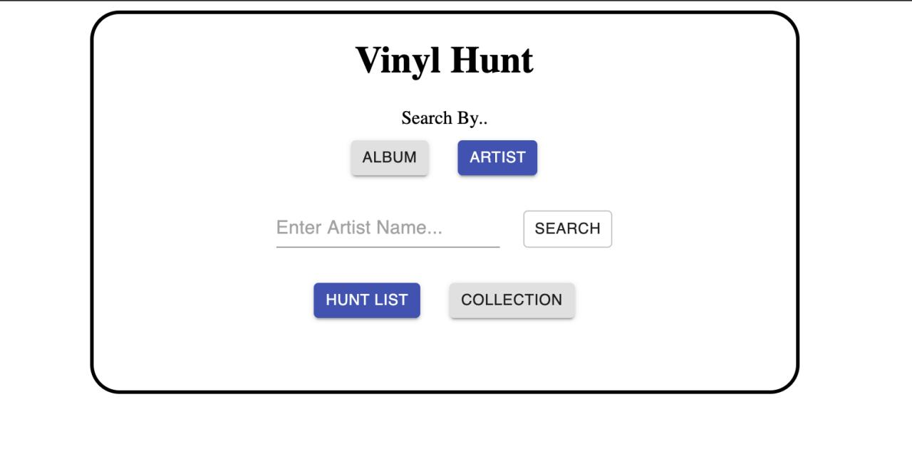
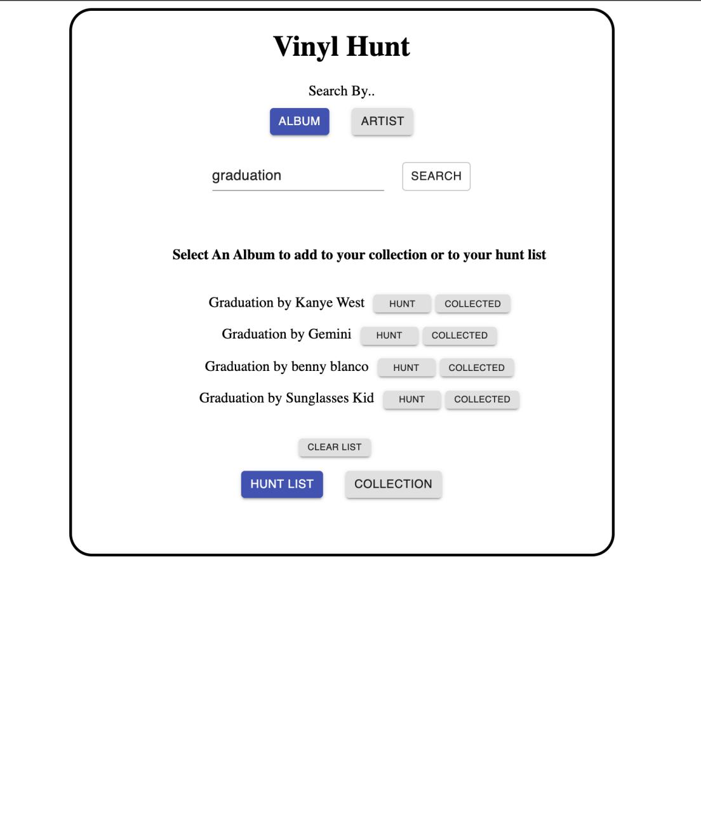
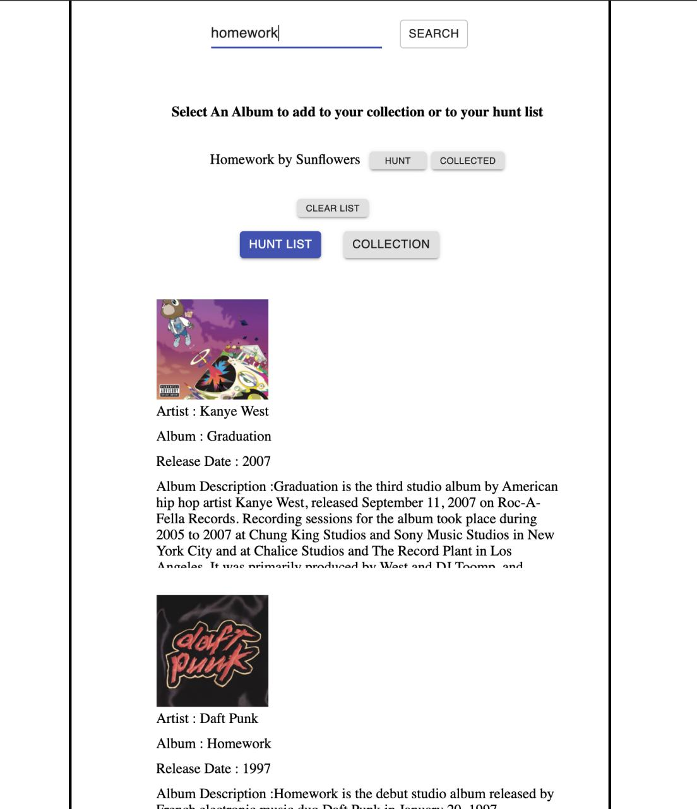

***** **API FIX AND REFACTORING IN PROGRESS** *****


Vinyl Hunt 


---
Vinyl Hunt is an web application that allows a user to keep track of the their vinyl record collection list and a list of records they are looking to purchase(hunt). Containerized using docker compose,

Tech Stack
---
- React
- Webpack
- Babel
- Axios
- Docker Compose
- Express

Building and Running on local host
  ** *Docker must be installed within local machine* **
  1. Install Dependencies within root file
   ```sh
   npm install
   ```
   

  2. Execute Docker Compose to build container 
   ```sh
   docker-compose up
   ```
    
  3. Both Web and Database containers should be running after 15 sec.
  4. To see if containers are up and running, execute command 
   ```sh
   docker ps
   ```
   




Future Implementations
---
- User Login / Authentication 
- User data stored within Database
- Modal addition for record information
